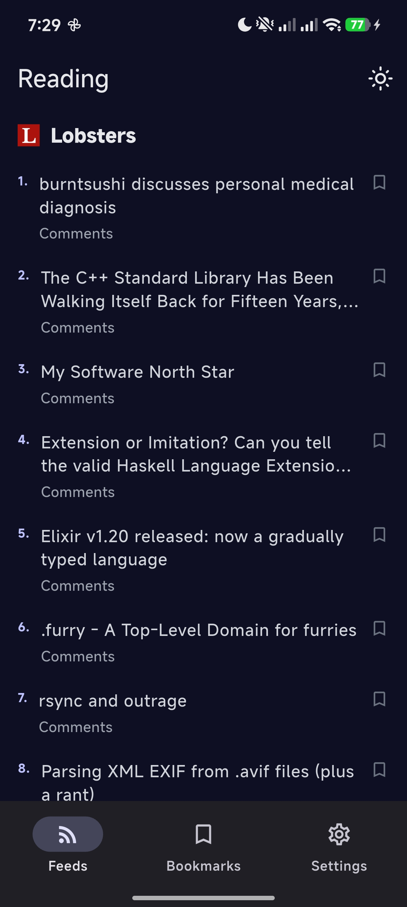
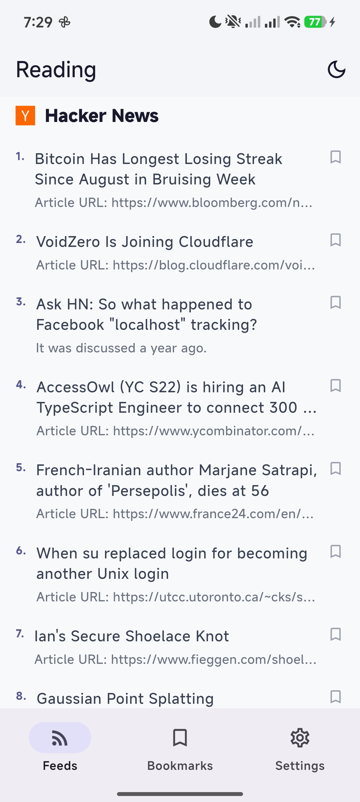

# Reading
**A minimal RSS news aggregator**

---

## About

Reading is a minimal RSS feed reader built with Flutter.

## Features

- Follow RSS and Atom feeds
- Add custom sources
- Import and export your feed list
- Bookmark articles
- Reorder your sources
- Dark mode support
- Copy links with a long press

## License

MIT
